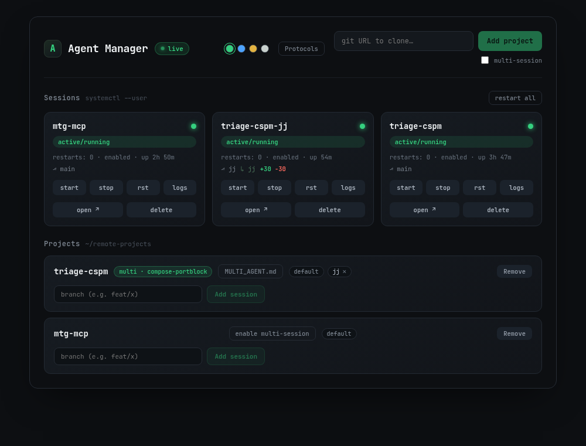
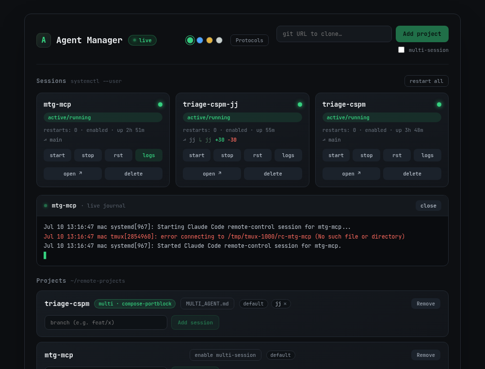
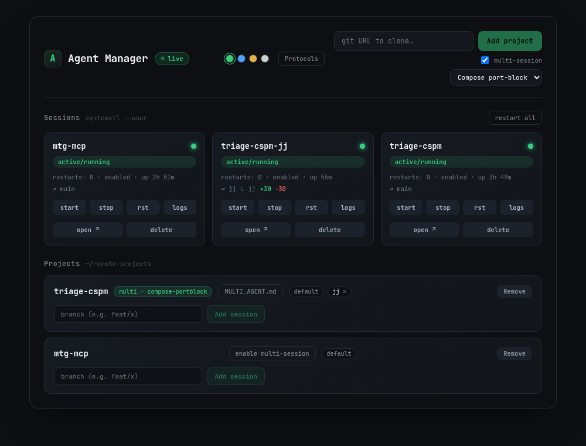
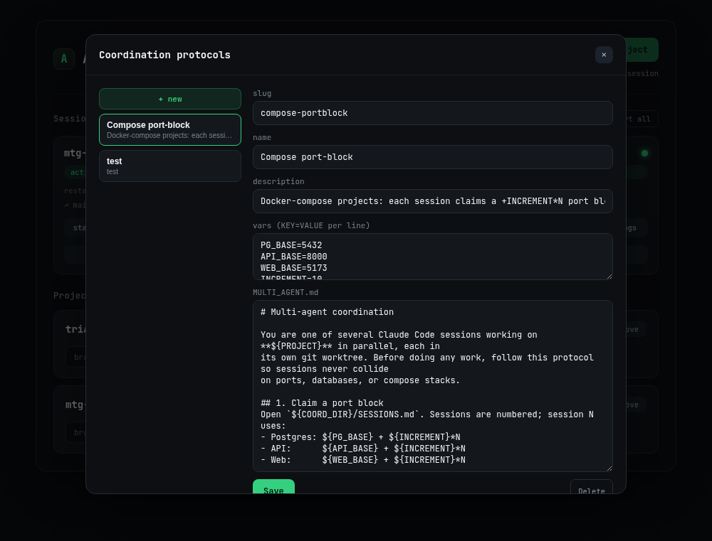
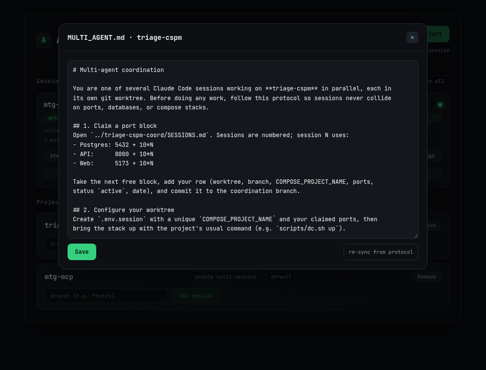

# Agent Manager

A local, single-user web control panel for [Claude Code](https://claude.com/claude-code)
**remote-control (RC)** sessions, one per repo, run as `systemd --user` services.
Live dashboard over `systemctl --user`/`journalctl`, one-click provisioning (clone →
pre-seed trust → enable the session), and a **coordination-protocol library** for running
several sessions on one repo without them stepping on each other.

It runs entirely on your own machine as your own user — no root, no cloud, no auth. Bind
it to loopback (default) or add your LAN IP to reach it from other devices at home.



## Requirements

- Linux with **systemd** (uses `systemctl --user`)
- **Node.js** 20+ (tested on 25/26)
- **tmux** — RC sessions run inside a private tmux PTY (see "How sessions run")
- **git**
- The **`claude` CLI**, logged in with a full-scope login token (`claude /login`)
- A directory of repos at `~/remote-projects` (override with `AM_REMOTE_ROOT`)

## One-time setup

1. Let your user services run at boot / without an active login:
   ```bash
   loginctl enable-linger "$USER"
   ```
2. Backend deps: `cd backend && npm install`
3. Build the SPA: `cd frontend && npm install && npm run build`
4. Install + start the manager service (edit `ExecStart`'s node path if needed):
   ```bash
   cp deploy/agent-manager.service ~/.config/systemd/user/
   systemctl --user daemon-reload
   systemctl --user enable --now agent-manager
   ```
   On first run the backend installs `~/.config/systemd/user/claude-rc@.service` and
   seeds a built-in `compose-portblock` coordination protocol.
5. Open `http://127.0.0.1:8787`.

**After pulling backend or frontend changes:** `cd frontend && npm run build` then
`systemctl --user restart agent-manager` — the server doesn't hot-reload, and an
already-open browser tab keeps the old JS bundle until you refresh it too.

### Reaching it from other machines on your LAN

By default the server binds `127.0.0.1` only. To expose it on your home network, set
`AM_BIND` to a comma-separated list including your host's LAN IP, then restart:

```bash
mkdir -p ~/.config/systemd/user/agent-manager.service.d
printf '[Service]\nEnvironment=AM_BIND=127.0.0.1,192.168.1.50\n' \
  > ~/.config/systemd/user/agent-manager.service.d/override.conf
systemctl --user daemon-reload && systemctl --user restart agent-manager
```

If a LAN machine times out reaching it, the app is almost never the cause (a wrong
bind gives "connection refused," not a timeout) — check your Wi-Fi AP's **client/AP
isolation** setting and that both machines are on the same subnet.

## Configuration (env vars)

| Var | Default | Meaning |
|-----|---------|---------|
| `AM_BIND` | `127.0.0.1` | Comma-separated hosts to bind |
| `AM_PORT` | `8787` | Port |
| `AM_REMOTE_ROOT` | `~/remote-projects` | Where repos are cloned |
| `AM_STATIC` | _(unset)_ | Path to the built SPA (`frontend/dist`) to serve |
| `AM_PROTOCOLS_DIR` | `~/.config/agent-manager/protocols` | Coordination protocol library storage |

## Using the dashboard

### Session cards

One card per `claude-rc@<name>` systemd unit:

- **Status dot + pill** — `active/running` (green), `failed` (red), `activating` (amber),
  or `inactive/dead` (gray).
- **`restarts: N · enabled|disabled · up Xh Ym`** — the uptime badge only appears while
  the session is running.
- **`⎇ <branch>`** — the worktree's actual current git branch, plus a **`+N -M`** diff
  stat (lines added/removed) against the project's primary branch, when there's an actual
  diff. Refreshes every 15s. A worktree session also shows its worktree tag inline on the
  same line.
- **Actions:** `start` / `stop` / `rst` / `logs` (opens a live `journalctl -f` drawer,
  only one open at a time), **`open ↗`** (opens the session's live
  `claude.ai/code/session_…` URL in a new tab — hidden while the session is stopped, since
  there's nothing to open), and **`delete`** (confirms, then removes the session — a
  primary session's project, or just that one worktree session).



### Projects panel

One row per cloned repo: its session chips (`default` + any worktree branches, each
removable), a **Remove** button (blocked with a clear error if worktree sessions still
exist — remove those first), and an **Add session** control for creating another worktree
session on a branch.

### Adding a repo

Paste a git URL in the header and hit **Add project** — the manager clones it into
`~/remote-projects`, pre-seeds trust in `~/.claude.json`, and enables its `claude-rc@`
session, streaming each step live.

Check **multi-session** before submitting to also set the project up for multiple
concurrent sessions (see below) — pick a coordination protocol from the dropdown and the
manager scaffolds the coordination worktree and drops `MULTI_AGENT.md` into the primary
session as part of the same flow.



## Coordination protocols & multi-session

Running more than one Claude session on the same repo at once (e.g. one on `main`, one on
a feature branch) requires the sessions to coordinate — claiming distinct ports, database
names, etc. — so they don't collide. Agent Manager doesn't do that coordination itself;
instead it hands each session a **written protocol** (`MULTI_AGENT.md`) and lets the agent
follow it.

- **A protocol** is a reusable, named Markdown template of coordination instructions (e.g.
  "claim the next free port block in `SESSIONS.md`, use a unique `COMPOSE_PROJECT_NAME`").
  Manage the library from the **Protocols** button in the header — create, duplicate, or
  edit protocols, including the seeded built-in `compose-portblock`. A protocol can define
  `${VAR}` placeholders with defaults, overridable per project.

  

- **Enabling multi-session** on a project (at add-repo time, or later via the project's
  **enable multi-session** button) scaffolds a `<name>-coord` git worktree with a
  `SESSIONS.md` ledger, renders the chosen protocol into that project's own copy of
  `MULTI_AGENT.md`, and drops it — along with a `CLAUDE.local.md` importing it — into every
  worktree of that project. Both files are **untracked** (added to the repo's shared
  `.git/info/exclude`), so they never show up in `git status` or enter your commit
  history.
- **Editing `MULTI_AGENT.md`** — once multi-session is enabled, a `MULTI_AGENT.md` button
  opens an editor for that project's own copy (edits re-drop into every live worktree on
  save). **re-sync from protocol** discards local edits and re-renders from the library
  protocol's current version.

  

- **Adding a session** to a project that isn't multi-session yet no longer dead-ends: pick
  a protocol right there and the manager enables multi-session and retries automatically.
- Environment variable propagation to sessions is not yet implemented (planned).

## How sessions run

`claude --remote-control` is an interactive command and needs a TTY; run headless under a
plain `Type=simple` service it falls into `--print` mode and exits. So each session runs
inside its **own private tmux server** (`tmux -L rc-<name>`), which supplies the PTY and
keeps every session in its own cgroup — stopping one never touches another.

To attach and inspect a session directly:
`tmux -L rc-<name> attach -t claude-rc-<name>` (detach with `Ctrl-b d`).

**Verify isolation on the box:** `systemctl --user stop claude-rc@<a>`; a second session
`<b>` must stay online in the phone app.

## Known limitation

The dashboard shows systemd health (active / failed / restarts), not the Claude app's
"green dot" connection state — that lives in Claude's servers. Use the phone app's Code
tab for authoritative online status.
